<div align="center">

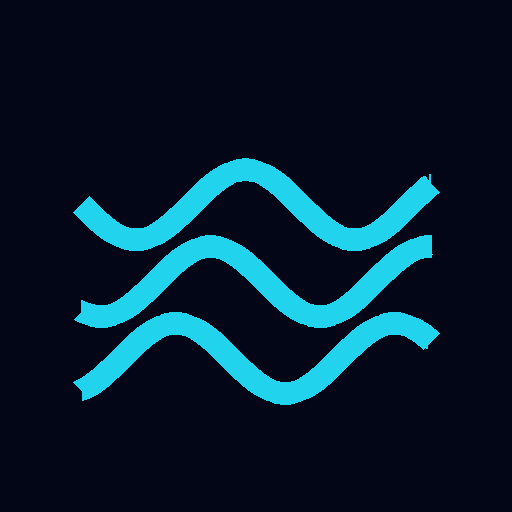

# Pumpfoil

**Record and analyze pump foiling sessions from your sports watch — GPS track, foiling distance, pump cadence and glide phases. Garmin, Wear OS and Apple Watch, with native iOS/Android apps and a web PWA.**

[pumpfoil.org](https://pumpfoil.org) · License: [AGPL-3.0](#license)

</div>

---

Pump foiling means riding a hydrofoil with no wind, waves or motor — you stay up purely by
pumping the board rhythmically. Pumpfoil records these sessions on your watch and turns the
raw GPS + accelerometer data into a detailed analysis: how long you were actually foiling, how
efficiently you pumped, and where you rode.

The signature feature: your track is **colored exactly over the foiling phases** (by speed, heart
rate or pump cadence) with **every detected pump stroke marked right on the route**.

<div align="center">
  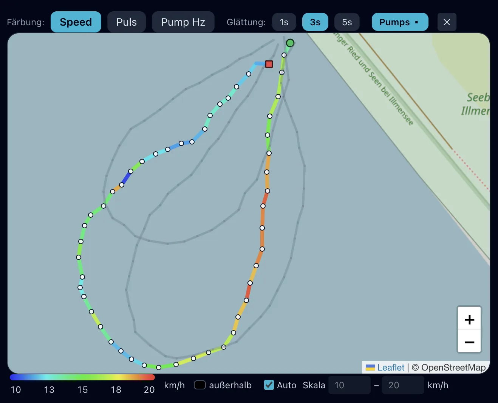
</div>

## Features

-  **Watch recording on every platform** — a [Connect IQ](watch/) app for **all ~78 Garmin
  devices** (fēnix, Forerunner, epix, Instinct, vívoactive, …), plus native **Wear OS** and
  **Apple Watch** recorder apps. They capture GPS + raw acceleration and upload the raw data.
-  **Native companion apps** — full **iOS** and **Android** apps (sessions, map, track preview,
  per-run stats, history with trend charts, community) alongside the installable **web PWA**.
-  **Automatic analysis** — foiling phases, distance, pump cadence and glide phases per session,
  detected server-side from GPS + accelerometer (ML model + GPS state machine).
-  **Color-coded track** — foiling segments colored by speed / heart rate / pump frequency, with pump markers.
-  **FIT upload** — analyze old activities too: drop in a `.fit` file (or Garmin's ZIP export).
-  **Labeling UI** — mark pump / glide / not-foiling ranges to build training data for the ML model.
-  **Community & history** — compare sessions over time, share runs; web UI in 7 languages.
-  **One-click watch download** — the site detects your watch model and serves the matching build.

## A look inside the app

| | |
|---|---|
| **Track your progress over time** | **Community records** |
| 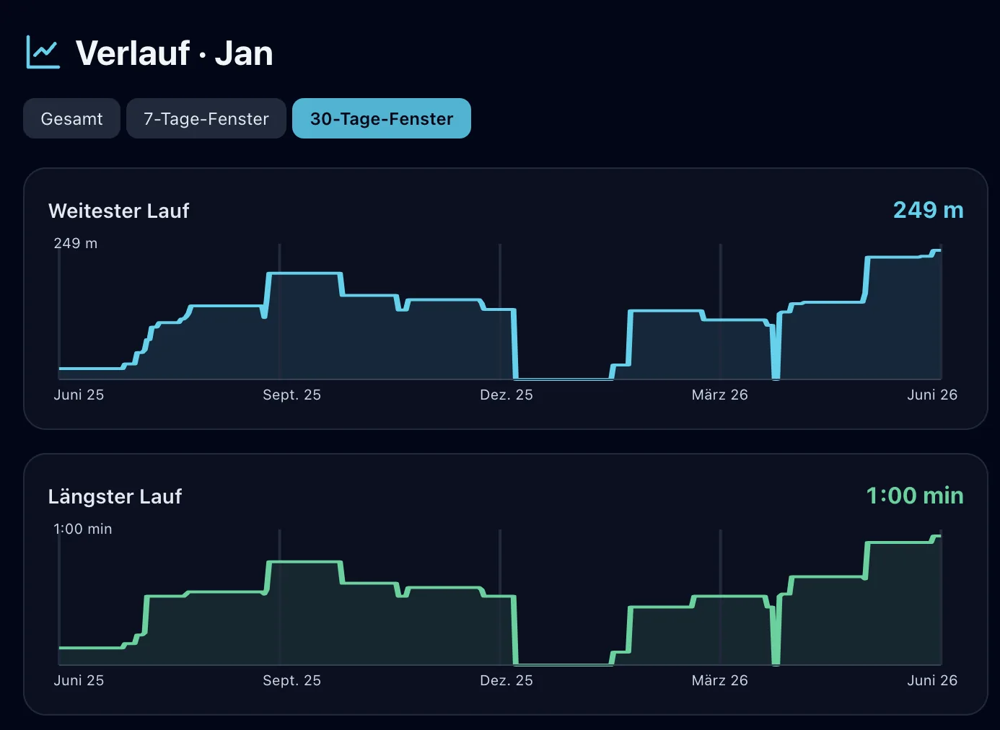 | 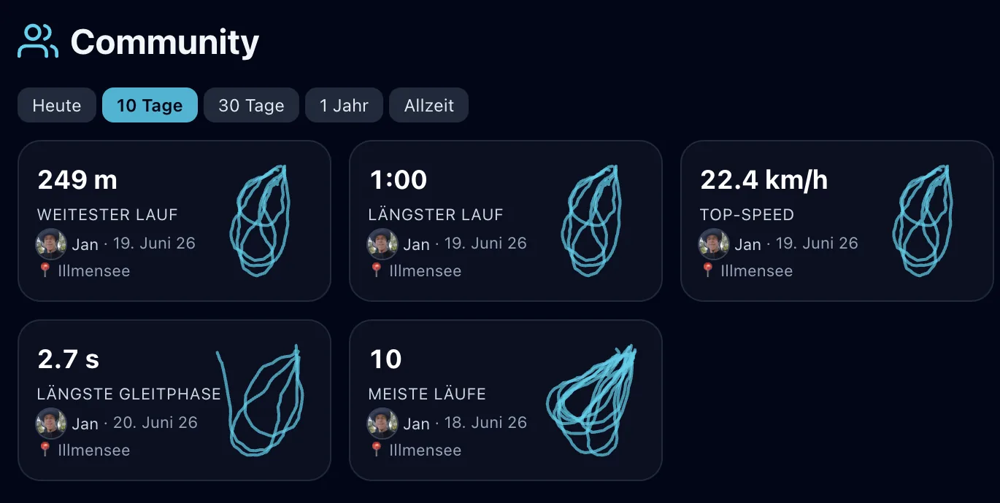 |
| **Community records per spot** | **Sessions — yours & everyone's** |
| 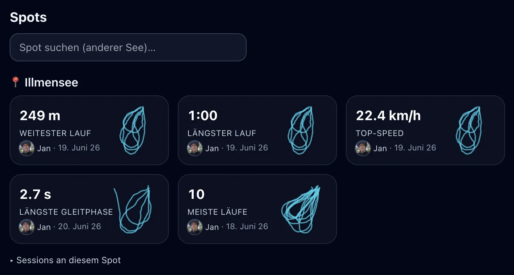 | 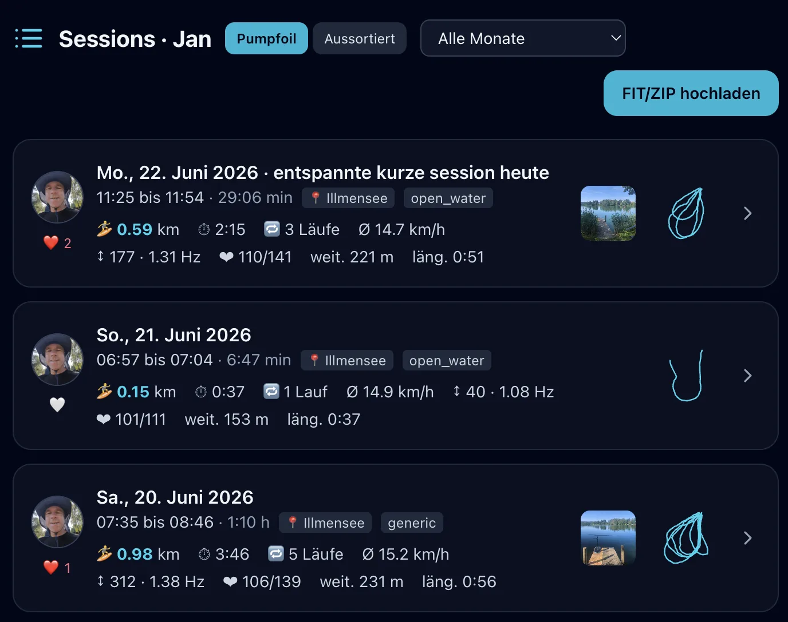 |
| **Detailed per-run stats** | |
| 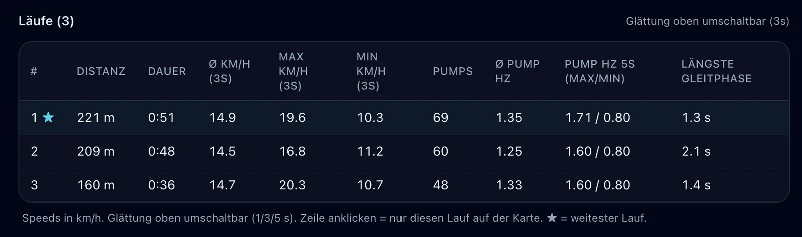 | |

## Apps & watches

Native apps on every platform — one account, one analysis backend.

**📱 Android phone**

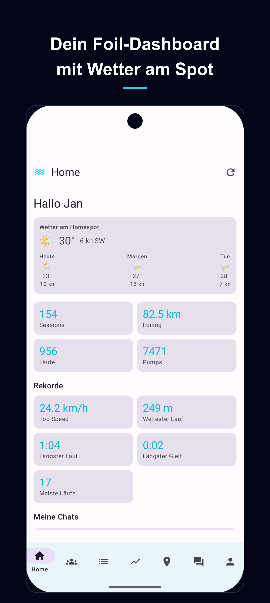 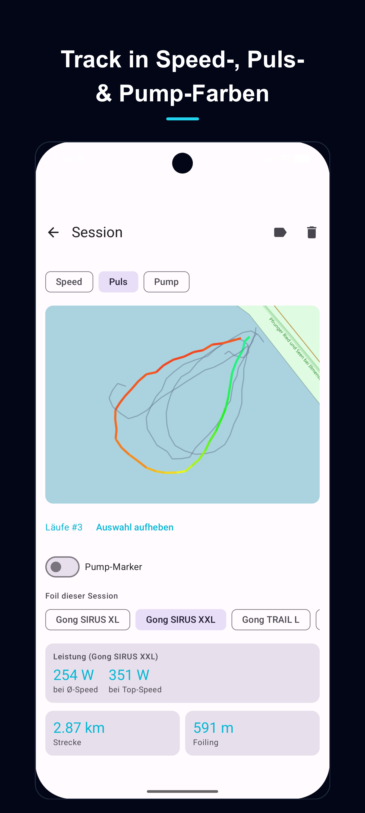 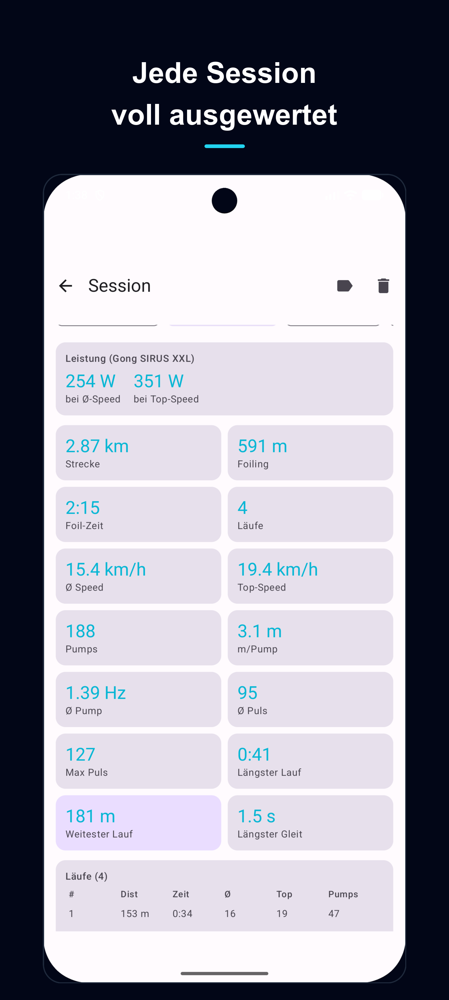 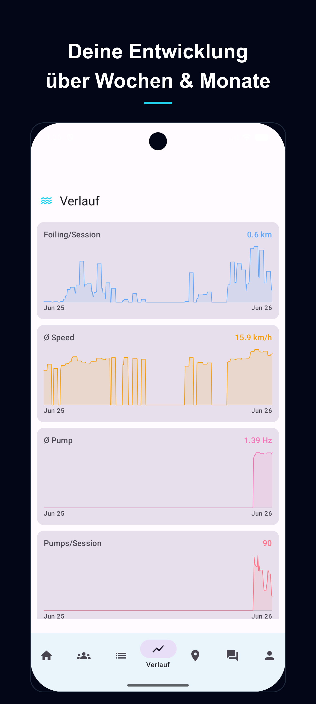

**📱 iOS phone**

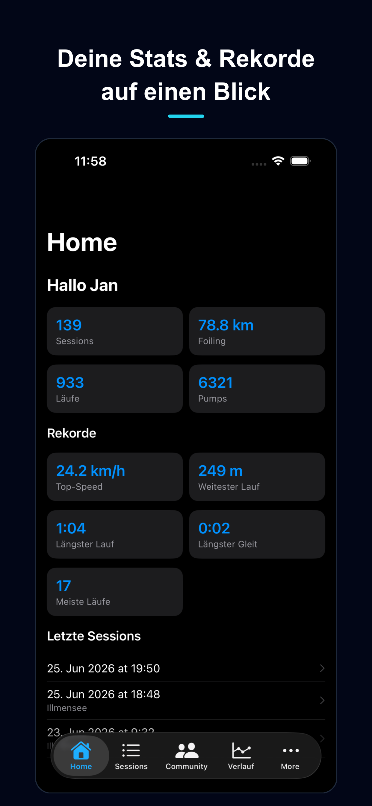 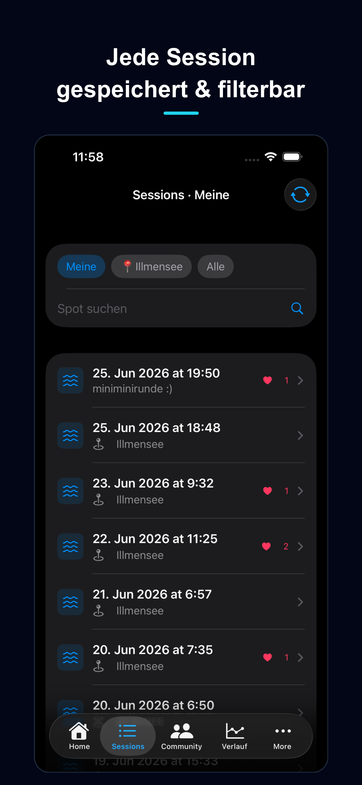 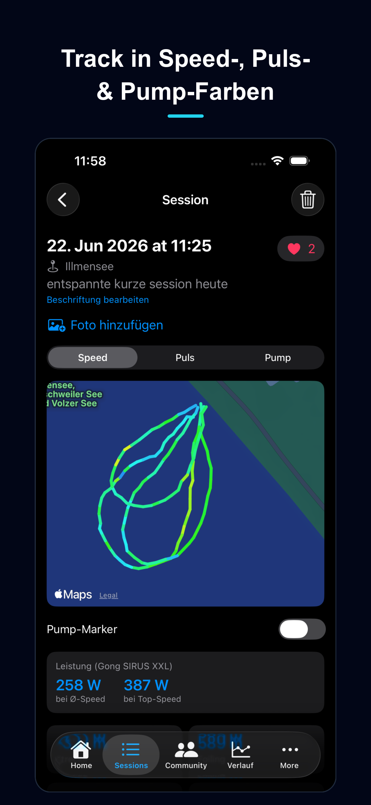 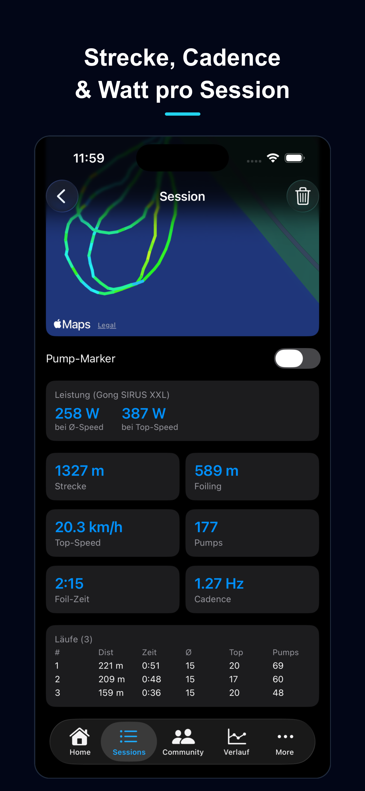

**⌚ Wear OS**

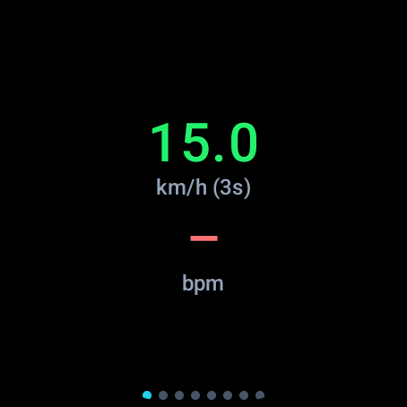 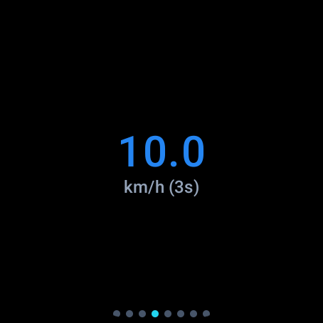 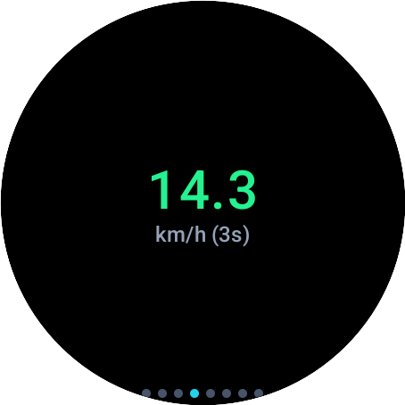 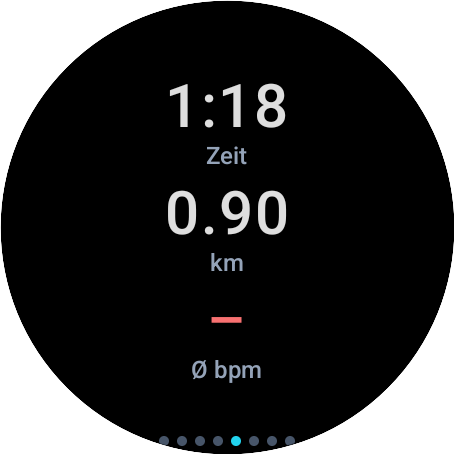

**⌚ Apple Watch**

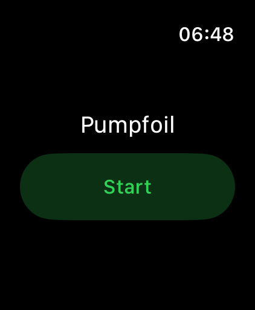 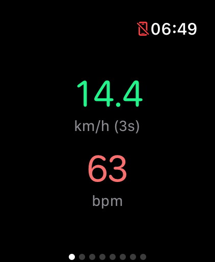 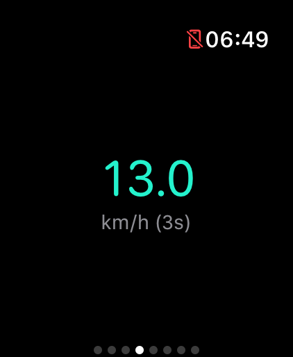 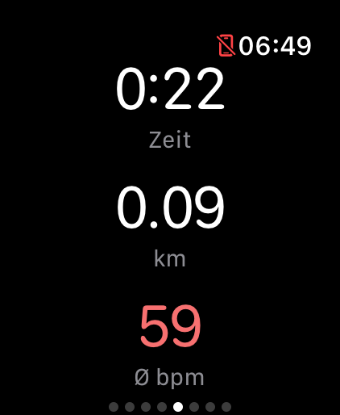

**⌚ Garmin** (all ~78 Connect IQ devices)

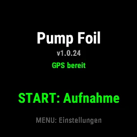 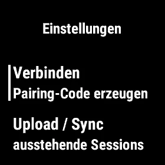 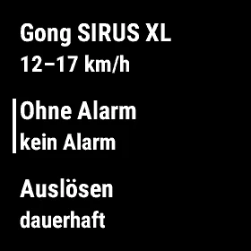 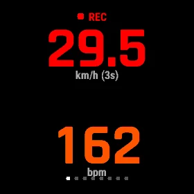 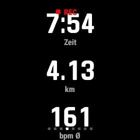

## Architecture

| Directory | Stack | Purpose |
|-----------|-------|---------|
| [`watch/`](watch/) | Monkey C (Connect IQ) | Garmin recorder (all ~78 devices): records GPS + raw accelerometer, uploads raw data |
| [`android/`](android/) | Kotlin · Jetpack Compose | One Gradle project: Android phone app (`:app`) + Wear OS recorder (`:wear`) |
| [`watch-apple/`](watch-apple/) | Swift · SwiftUI | iOS companion app (`Sources-iOS/`) with embedded Apple Watch recorder (`Sources/`) |
| [`server/`](server/) | Python · FastAPI · PostgreSQL · numpy/scipy/scikit-learn | Ingest, immutable raw storage, foiling/pump detection, REST API |
| [`web/`](web/) | React · Vite · TypeScript · Tailwind · Leaflet | Installable PWA: sessions, map, charts, labeling, community |
| [`deploy/`](deploy/) | systemd · Apache | Service unit, reverse-proxy config, backup timers |

Raw session data is always stored **complete and unmodified**, so any future detection model can be
re-run on old sessions. Detection runs server-side (fast iteration in Python, no watch recompile).

## Development

**Server**

```bash
cd server
python3 -m venv .venv && . .venv/bin/activate
pip install -e .
cp .env.example .env          # dev defaults to SQLite — no Postgres required
uvicorn app.main:app --reload --port 8090
# API docs: http://localhost:8090/api/docs
```

**Web**

```bash
cd web
npm install
npm run dev                   # Vite dev server, proxies /api to :8090
```

**Garmin watch** — requires the [Garmin Connect IQ SDK](https://developer.garmin.com/connect-iq/)
and a developer key (see `watch/setup-sdk.sh`). The SDK is **not** included (distributed by Garmin
under its own license). Build one device with `watch/build.sh <device>`, or all manifest devices
with `watch/build-all.sh` (also generates the download catalog the website serves).

**Android phone + Wear OS** — one Gradle project under [`android/`](android/) (modules `:app` and
`:wear`), Kotlin + Jetpack Compose. Build/verify with `./gradlew :app:compileDebugKotlin` /
`:wear:compileDebugKotlin` (JDK 21).

**iOS app + Apple Watch** — [`watch-apple/`](watch-apple/), Swift + SwiftUI, generated with
[xcodegen](https://github.com/yonaskolb/XcodeGen) (`project.yml`); built in Xcode on macOS.

The raw upload format (GPS + int16 accelerometer chunks) is specified in
[`docs/data-format.md`](docs/data-format.md).

## Privacy

Pumpfoil is a community platform: by design, your sessions are visible to other users in the
community feed. What it will **never** do is sell your data or hand it to third parties for
advertising or tracking. This repository contains **source code only** — no user accounts,
recordings, databases or Garmin SDK files.

## License

Pumpfoil is free software, licensed under the **GNU Affero General Public License v3.0**
([AGPL-3.0](LICENSE)). In short: you may use, study, modify and redistribute it, but if you run a
modified version as a network service, you must make your source available to its users.

It is a community project — contributions are welcome.
