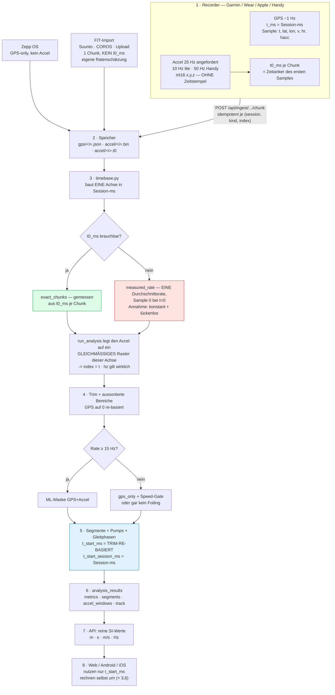

# Datenweg: von der Uhr bis zur Anzeige

**Zweck.** Diese Datei sagt, welche Daten mit welchen Raten, Zeitstempeln und Offsets an jeder
Station wirklich verwendet werden — belegt an echten Sessions, nicht aus dem Gedächtnis. Sie
existiert, weil dieselben drei Verwechslungen wiederholt zu Fehlbefunden geführt haben:

1. **Roh-Zeitstempel ≠ Analyse-Zeit.** Die Segment-Zeiten sind auf den Trim **re-basiert**.
2. **Index ≠ Sekunde.** GPS ist ~1 Hz, aber mit Löchern; es gibt kein gleichmäßiges Raster.
3. **Getaggte Rate ≠ echte Rate.** Die Uhr meldet 25 Hz und *kann* 50 Hz liefern (gerätespezifisch,
   §3) — die gemeldete Rate ist eine Anforderung, keine Messung.

> **Harte Regel:** kein Befund über Zeitachsen ohne Gegenprobe. Am Ende stehen fertige
> Prüf-Rezepte (§10). Wer eine Zahl nicht gegengeprüft hat, schreibt sie nicht als Tatsache.

Stand: 2026-08-10, **1224 analysierte Sessions**; Detailmessungen an Session #1814 (Wear OS, 2,5 h,
449.129 Accel-Samples, 8.181 GPS-Samples).

> **Die Zahlen hier sind Momentaufnahmen** — der Bestand wächst, und Fixes verändern sie. Statt sie
> zu glauben: **`scripts/pipeline-check.py` neu laufen lassen** (rein lesend, Rezept (0) in §10). Das Skript
> gibt genau die Zahlen aus, die unten zitiert werden, und prüft ihre Quersumme selbst.

**Abgedeckt:** Upload-Vertrag (§2) · alle Recorder — Garmin, Wear, Apple, Zepp, Handy — plus
FIT-Import und `record_mode` (§3) · Speicherformate (§4) · Bau der Accel-Zeitachse (§5) ·
GPS-Auswertung und wann der Accel überhaupt zählt (§6) · Accel-Fenster (§7) · DB und
Anzeigeschicht (§8) · **fünf** belegte Defekte bzw. widerlegte Vermutungen (§9: drei behoben, einer
offen, eine Vermutung widerlegt) · Prüf-Rezepte (§10).

## Der Weg im Überblick



**Grün ist der belastbare Weg** (`t0_ms` je Chunk = gemessene Achse), **rot der Notbehelf**: eine
einzige Durchschnittsrate, die eine konstante, lückenlose Spur ab t = 0 unterstellt — beides ist bei
wechselnder Sensorrate falsch (§5). Blau markiert die Stelle, an der zwei Zeitbegriffe nebeneinander
in dieselbe JSON-Struktur geschrieben werden (§1) — die häufigste Verwechslung.

Historie: bis 2026-08-10 baute `run_analysis` an dieser Stelle eine **zweite, eigene** Zeitachse und
benutzte `timebase.py` gar nicht (§9.2), und das Zusammenführen zweier Sessions warf die Zeitanker
weg (§9.5). Beides ist behoben, der Bestand nachgezogen.

---

## 1. Die eine Zeitachse

Nullpunkt jeder Session ist der **Aufzeichnungsstart auf der Uhr**. Alles heißt
`*_ms` = **Millisekunden seit Session-Start**. Es gibt drei Zeitbegriffe, und sie werden
regelmäßig verwechselt:

| Begriff | Wo | Beispiel #1814 |
|---|---|---|
| **Session-ms** | Rohdaten (`gps/*.json`, `t0_ms`), `timebase.py`, `t_*_session_ms` | Lauf 9 = 5.111.308…5.188.309 |
| **Trim-re-basierte ms** | `segments_json.t_start_ms`, `accel_windows_json.t_center_ms` | Lauf 9 = 4.510.005…4.587.006 |
| **Sample-Index** | nur innerhalb von `gps.py` (`i_start`/`i_end`) | Lauf 9 = 3901…3978 |

Umrechnung: `Session-ms = re-basierte ms + sessions.trim_start_ms` (bei #1814: + 601.303 ms).

Alle drei Zahlen für denselben Lauf sind verschieden. **Wer sie gleichsetzt, misst am falschen
Ort** — genau das ist bei der Untersuchung von #1814 passiert (dreimal, bis die Gegenprobe kam).

---

## 2. Upload-Vertrag (Server-Sicht)

`server/app/api/ingest.py` + `schemas.py`. Ergänzt `docs/data-format.md` (Client-Sicht) und
`docs/ingest-contract.md` (wie eine neue Plattform Recorder wird).

**Session anmelden** — `POST /api/ingest/session`, `SessionStartIn`:

| Feld | Default | Bedeutung |
|---|---|---|
| `gps_hz` | `1` | **nominale** GPS-Rate. In allen 1224 Sessions `1`. Nur Rechengröße für Fensterbreiten, nie Wahrheit. |
| `accel_hz` | `25` | **angeforderte** Accel-Rate. Nie Wahrheit (§5). |
| `accel_scale` | `2048` | int16-Einheiten pro g. In allen 1224 Sessions `2048`. |
| `expected_chunks` | – | für Resume/Fortschritt |

**Chunk hochladen** — `POST /api/ingest/session/{uuid}/chunk`, `ChunkIn`:

| Feld | Bedeutung |
|---|---|
| `index` | Chunk-Nummer. Eindeutigkeit ist **(session, kind, index)** — der Vertrag erlaubt getrennte Zähler je Sorte. |
| `kind` | `"gps"` \| `"accel"` |
| `data` | GPS: Liste von Samples. Accel: base64-int16 (s. §4) |
| `t0_ms` | **optional** — Session-ms des ersten Samples im Chunk. Der einzige belastbare Zeitanker für Accel. |

Idempotent: gleiche `(session, kind, index)` überschreibt → Resume kostet keine Daten.

---

## 3. Was die Plattformen wirklich schicken

Gemessen über alle nicht gelöschten Sessions:

| Plattform | Sessions | getaggt `accel_hz` | Chunk-Nummerierung | `t0_ms` |
|---|---|---|---|---|
| garmin | 519 | 25 (490), 10 (28, Lite-Modus), 100 (1) | **getrennt/lückig** je Sorte | ab 1.0.71/72 ja |
| wear | 57 | 25 | **gemeinsamer** Zähler | ab 1.2.16 ja |
| apple | 60 | 25 | **gemeinsamer** Zähler | ab 1.1.18 ja |
| zepp | **0** | – (kein Accel) | – | – |
| (Gerät gelöscht/alt) | 588 | 25 / 50 / 100 | gemischt | meist nein |

Zepp hat 8 gepairte Geräte, aber noch **keine einzige aufgezeichnete Session** — die Zepp-Spalte in
Paritäts-Tabellen ist also unbelegt, nicht bestätigt.

Zwei Konsequenzen, die man kennen muss:

- **Der gemeinsame Zähler (nur wear/apple) datiert Accel-Chunks über die GPS-Nachbarn.** Weil die
  Nummern verschränkt sind (bei #1814 Accel 915 + GPS 851 = Nummern 0…1765 lückenlos), tragen die
  GPS-Chunks echte Zeitstempel für die Accel-Chunks daneben. Bei #1814 weicht das von `t0_ms` im
  Mittel nur 4,5 s ab — am **Anfang** aber bis 72 s, weil die ersten Accel-Chunks vor dem ersten
  GPS-Chunk liegen und die Interpolation dort auf den ersten GPS-Zeitstempel klemmt. Als
  unabhängige Gegenprobe für die Session*mitte* brauchbar, als Zeitanker nicht.
  **Für Garmin funktioniert es gar nicht.**
- **`accel_hz` ist eine Anforderung, keine Messung.** Alle Recorder fordern 25 Hz an (10 Hz im
  Lite-Modus), das Gerät liefert die nächstliegende unterstützte Rate. Gemessen an den Sessions mit
  exakter Achse (Faktor = geliefert / angefordert):

  | Plattform | n | Median geliefert | liefert ≥ 1,8× | Werte der Ausreißer |
  |---|---|---|---|---|
  | garmin | 114 | 25,00 Hz | **0** | – |
  | wear | 33 | 25,00 Hz | **9** | 49,4 … 50,21 Hz |
  | apple | 42 | 25,10 Hz | **1** | 50,29 Hz |
  | Handy (getaggt 50, Gerät gelöscht) | 8 | 54,19 Hz | 3 | 109 … 127 Hz |

  Also: **Connect IQ hält die Rate ein, Wear/Apple nicht immer** — und zwar gerätespezifisch, nicht
  plattformweit (bei Wear ~27 % der Sessions). Genau diese Fälle sind die aus §9.1.

### 3.1 Die Recorder im Einzelnen

**Garmin** (`watch/source/SessionRecorder.mc`)
- Modi über `record_mode` (aus der Server-Config): `full` = 25 Hz · `lite` = 10 Hz ·
  `gps` = ohne Accel. `_isLowMem()` erzwingt zusätzlich GPS-only (Instinct 2 & Co., 96 KB).
- Accel über `Sensor.registerSensorDataListener(… :sampleRate => _accelHz)`; kann ein Gerät das
  nicht, bleibt es GPS-only. GPS über `Position.LOCATION_CONTINUOUS` (~1 Hz).
- **Zeitbasis mit Sekunden-Auflösung:** `_elapsedMs() = (Time.now() − _startedAt) × 1000 − _pausedMs`.
  Alle Garmin-Zeitstempel sind daher Vielfache von 1000 ms — sichtbar daran, dass die `t0`-Werte
  ganzzahlige Sekunden sind (Median erstes `t0` = 1,00 s).
- **Pausen sind für den Server unsichtbar:** `_pausedMs` wird abgezogen, damit die Achse „lückenlos"
  bleibt. Eine Pause komprimiert also echte Zeit, und die Analyse kann das nicht erkennen.
- Chunks: Accel `ACCEL_CHUNK_SAMPLES = 1500` (= 60 s bei 25 Hz), GPS `GPS_CHUNK_SAMPLES = 120`
  (= 120 s). `t0_ms` je Accel-Chunk in `_accelT0`, **gedeckelt auf 600 Einträge** (~10 h) — danach
  fehlen den späten Chunks die Zeiten und der Server fällt für die Session auf `measured_rate`
  zurück (bewusst so, ein wachsendes Dict sprengt den Object-Store kleiner Uhren).

**Wear OS** (`android/wear/.../Recorder.kt`, `RecorderService.kt`)
- `registerListener(…, 1_000_000 / accelHzActual)` — das ist ein **Hinweis** in µs; Android liefert
  die nächstliegende unterstützte Rate und darf sie zur Laufzeit ändern (Power-Save, Batching).
- GPS: `LocationRequest.Builder(PRIORITY_HIGH_ACCURACY, 1000)` → nominal 1 Hz.
- Zeitbasis: `elapsedMs() = System.currentTimeMillis() − startMs`, Millisekunden-Auflösung.
  ⚠️ **Wanduhr, nicht `elapsedRealtime()`** — eine Zeitkorrektur (NTP) mitten in der Session
  verschiebt die Zeitstempel. Bisher kein belegter Fall, aber die Konstruktion lässt es zu.
- `t0_ms` je Accel-Chunk (`accelT0`, gesetzt beim ersten Sample eines Chunks) und je GPS-Chunk.

**Apple Watch** (`watch-apple/Sources/Recorder.swift`)
- `motion.accelerometerUpdateInterval = 1.0 / accelHzActual`; 25 Hz bzw. 10 Hz im Lite-Modus.
- Zeitbasis: `elapsedMs() = Date().timeIntervalSince(startedAt) × 1000` (Wanduhr, ms).
- `t0_ms` je Chunk; Chunk-Nummern aus einem gemeinsamen Zähler.

**Handy als Recorder** (`android/app/.../Recorder.kt`, `watch-apple/Sources-iOS/PhoneRecorder.swift`)
- Beide fordern **`ACCEL_HZ = 50`** an („Handys können hoch"), Android über denselben µs-Hinweis wie
  Wear, iOS über `accelerometerUpdateInterval = 1/50`.
- **Der Aufzeichnungsmodus wird ignoriert:** `accelHzActual = ACCEL_HZ` ohne Bedingung — es gibt
  keinen Lite-/GPS-Modus auf dem Handy.
- Zeitbasis Wanduhr in ms (`System.currentTimeMillis()` bzw. `Date().timeIntervalSince1970`),
  `t0_ms` je Chunk.
- Gemessen liefern Handys **deutlich mehr als angefordert**: Median 99,99 Hz, einzelne Modelle
  konstant 125 Hz (Samsung SM-A556B) — der Grund für die Zeile „getaggt 50, geliefert 109…127 Hz"
  in §3.

**Aufzeichnungsmodus (`record_mode`) — die ganze Kette**
`devices.py:52 _effective_record_mode`: **Geräte-Override** (`device_tokens.record_mode`, einer von
`full|lite|gps`) → sonst **Nutzer-Default** (`users.settings_json.record_mode`) → sonst `full`.
Ausgeliefert als `recordMode` in `GET /api/devices/config`. Auf der Uhr:

| Plattform | liest aus | `full` | `lite` | `gps` |
|---|---|---|---|---|
| Garmin | `record_mode` im Object-Store | 25 Hz | 10 Hz | ohne Accel; `_isLowMem()` erzwingt es zusätzlich |
| Wear OS | SharedPreferences `pumpfoil` | 25 Hz | 10 Hz | (kein eigener Zweig gesehen) |
| Apple Watch | `UserDefaults.recordMode` | 25 Hz | 10 Hz | ja (`recordMode != "gps"` gated den Sensor) |
| Handy (Android/iOS) | – | **50 Hz, immer** | – | – |

**FIT-Import** (`server/app/fitimport.py` + `api/sessions.py:322 import_parsed_session`)
Speist den manuellen `.fit`-Upload, Suunto (`api/suunto.py`) und COROS (`api/coros.py`) — alle
durch **denselben** Parser.
- GPS aus `record`-Messages: `t_ms = (timestamp − t0) × 1000`, also Session-ms wie bei den Uhren.
  FIT-`timestamp` hat Sekunden-Auflösung → auch hier Vielfache von 1000 ms.
- Accel aus `accelerometer_data`-Messages, `calibrated_accel_*` in **milli-g** → int16 mit
  `accel_scale = 2048` (`_MG_TO_INT16`).
- ⚠️ **Die Rate wird geschätzt** (`fitimport.py:97`): `hz = round(len(xs) / span_s)` über die erste
  bis letzte Accel-Message, und bei `hz < 5 or hz > 200` **pauschal auf 25 gesetzt**. Das ist ein
  *dritter* unabhängiger Ratenschätzer neben `timebase.py` und `run_analysis` (§9.2).
- **Genau ein Chunk je Sorte** (Index 0) und **kein `.t0`-Sidecar** (`storage.save_accel_raw`
  schreibt keins). Importierte Sessions können deshalb nie `exact_chunks` erreichen — sie sind der
  Großteil der 489 Fälle „1 von 1 Chunks ohne t0_ms" aus §5.
- `gps_hz` wird fest auf 1 gesetzt, unabhängig davon, was in der Datei steht.
- Die Originaldatei wird unverändert daneben gelegt (`save_original_upload`), damit ein Import nach
  einem Backup-Rücklauf wiederherstellbar bleibt.

**Zepp OS / Amazfit** (`watch-zepp/page/index.js`)
- `GPS_HZ = 1, ACCEL_HZ = 0, ACCEL_SCALE = 0` → **GPS-only, kein Beschleunigungssensor.**
  Damit sind Pump-Kennzahlen auf Zepp grundsätzlich nicht möglich; die Analyse landet auf
  `time_base: none`.
- Zeitbasis: `Date.now() − startedAtMs` (Wanduhr, ms).

---

## 4. Was auf der Platte liegt

`server/data/<session_uuid>/`:

| Pfad | Format |
|---|---|
| `accel/<index>.bin` | int16 **little endian**, 3 Achsen **verschränkt** (x,y,z,x,y,z…). Samples = Dateigröße / 6. Einheit: Rohwert / `accel_scale` = g |
| `accel/<index>.t0` | Sidecar mit `t0_ms`, **nur wenn der Client es geschickt hat** |
| `gps/<index>.json` | JSON-Liste von Samples (s. u.) |

**GPS-Sample = `[t_ms, lat, lon, speed_mps, hr_bpm, h_acc_m]`** — 6 Felder, bei #1814 in allen
8.181 Samples vollständig (kein `null`). Beispiel:
`[5111308, 52.4887182, 13.4816761, 3.13, 0, 9.94]`

- `t_ms` = **Session-ms**, nicht Uhrzeit, nicht Unix-Zeit.
- `speed_mps` = **von der Uhr gemeldet** (Doppler). Wird bevorzugt benutzt (§6).
- `hr_bpm` = **0, wenn kein Puls aufgezeichnet wurde** (bei #1814 durchgehend 0). Das ist kein
  Fehler in den Daten, aber `detect_v2`s Fremdkraft-Erkennung über die Pulsantwort kann dann nichts
  entscheiden.
- `h_acc_m` = horizontale Genauigkeit (bei #1814 3,8…122 m).

**GPS hat Löcher.** #1814: 8.181 Samples auf 9.086 s Spanne → **905 Sekunden ohne Fix**. Ein
Sample-Abstand ist also *typisch* ~1 s, aber nicht garantiert. Deshalb ist jede Rechnung
„Index × 1 s" falsch.

---

## 5. Die Accel-Zeitachse — die gefährlichste Stelle

`server/app/analysis/timebase.py`. Accel-Samples tragen **keine eigenen Zeitstempel**; die Achse
wird gebaut. Rangfolge:

1. **`exact_chunks`** — `t0_ms` je Chunk. Die einzige gemessene Variante. 201 Sessions.
2. **`measured_rate`** — eine *einzige* Rate `n / gps_end_ms`, Sample 0 bei t = 0. **453 Sessions.**
3. **`uncertain`** — getaggte Rate als Notbehelf. 51 Sessions.
4. **`none`** — kein Accel. 519 Sessions.

Die Herkunft steht in **jeder** Session unter `analysis_results.metrics_json`:
`time_base`, `accel_hz`, `accel_hz_tagged`, `accel_hz_measured`, `accel_hz_deviation`,
`time_base_notes`. **Diese Felder zuerst lesen, bevor man eine Zahl glaubt, die vom Accel abhängt.**

> **Seit 2026-08-10 rechnet `run_analysis` auf genau dieser Achse** — vorher baute es sich eine
> zweite, eigene (Durchschnittsrate + Index-Arithmetik), weshalb `time_base: exact_chunks` nichts
> über die angezeigten Pumps aussagte (§9.2). `metrics_json.accel_axis` belegt jetzt je Session, auf
> welcher Achse Pumps und Gleitphasen wirklich gerechnet wurden; **bei Sessions ohne Reanalyse fehlt
> das Feld** — dort gilt noch der alte Stand.

Variante 1 wird verworfen, wenn eine von vier Prüfungen fällt (Zähler über alle Sessions):

| Grund | Sessions | Bewertung |
|---|---|---|
| `N von N Chunks ohne t0_ms` | 490 | korrekt — alte Clients, FIT-Import |
| `t0_ms nicht streng wachsend` | 10 | korrekt — Default-Nullen |
| **`Chunk-Rate X Hz außerhalb des Bandes um Y Hz`** | **3** | **war 10, s. §9.1** |
| `Chunk-Kette reicht über das GPS-Ende hinaus` | 1 | korrekt — fremde Zeitbasis |

Die Summe 490 + 10 + 3 + 1 = 504 ist genau `measured_rate` (453) + `uncertain` (51) — die
Aufstellung ist also vollständig, es gibt keinen weiteren Verwerfungsgrund. (`pipeline-check.py`
prüft diese Quersumme bei jedem Lauf und meldet „ABWEICHUNG", falls ein neuer Grund dazukommt.)

Die Bandverwerfungen sind von 10 auf 3 gefallen: 7 Sessions haben durch den Fix in §9.1 ihre exakte
Achse bekommen. Die 3 verbliebenen sind die mit sehr *niedriger* Chunk-Rate — die bleiben absichtlich
draußen (§9.3).

**Was `measured_rate` unterstellt** (und bei #1814 falsch ist):

- die Accel-Spur beginnt bei Session-ms 0,
- sie ist **lückenlos**,
- sie hat **eine konstante Rate**,
- `gps_end_ms` (Zeitstempel des letzten GPS-Samples) sei die Dauer der Spur — der GPS-Vorlauf bis
  zum ersten Fix (bei #1814 **72,4 s**) wird also mitgerechnet.

---

## 6. GPS-Auswertung

`server/app/analysis/gps.py`, Eintritt `analyze_gps(samples, gps_hz=1, …)`.

**Es gibt kein Resampling.** Gerechnet wird direkt auf der Sample-Liste; `gps_hz` dient nur dazu,
Sekunden in Sample-Anzahlen umzurechnen (Median-Fenster, Dwell-Zeiten). Bei Löchern in der Spur
deckt ein „15-s-Fenster" also mehr als 15 echte Sekunden ab — bekannte Ungenauigkeit, keine
Wahrheitsverletzung.

Reihenfolge (`gps.py:228`…):
1. Koordinaten säubern: `_fill_invalid_coords` (180/180-Sentinels), `_repair_spikes`.
2. Schrittdistanzen; Einzelschritte über `OUTLIER_STEP_M` (~>90 km/h in 1 s) zählen **nicht**.
3. **Geschwindigkeit**: `speed = where(isnan(speed_raw), speed_from_pos, speed_raw)` — das
   **gemeldete** Feld hat Vorrang, Position/Zeit ist nur Ersatz für fehlende Werte.
4. Glitch-Filter: Werte über `GLITCH_SPEED_MPS` → 15-s-Median.
5. Doppler-Burst-Filter (relativ **und** absolut, 2026-07-04) → 15-s-Median.
6. Maske (Modell oder Heuristik) → Segmente → Nachbearbeitung (`_merge_no_stop`,
   `_repair_deadreckoning`, `_trim_fall_tail`, `_extend_ends_forward`).

**Segment-Felder** (`analysis_results.segments_json`, **42** Felder je Lauf):
`i_start`/`i_end` = Sample-Index · `t_start_ms`/`t_end_ms` = **trim-re-basiert** ·
`t_start_session_ms`/`t_end_session_ms` = **Session-ms** · `distance_m`, `max_speed_mps`,
`pumps`, `num_glides`, `longest_glide_s`, …

`longest_glide_s` ist die **längste Lücke zwischen zwei erkannten Pumps** innerhalb des Laufs —
keine gemessene Gleitphase. Bei #1814/Lauf 9: 42 Pumps, 43 Glides, längste Lücke 45,04 s.
Ein hoher Wert heißt deshalb primär: *hier wurden Pumps nicht erkannt*.

---

### 6.1 Wann der Beschleunigungssensor überhaupt benutzt wird

`analysis/__init__.py`: `accel_usable = accel.shape[0] > 0 and accel_hz >= MODEL_MIN_ACCEL_HZ`
mit **`MODEL_MIN_ACCEL_HZ = 15.0`** (das Modell ist auf ~25 Hz trainiert; darunter — z. B. FR55 mit
real ~2,5 Hz — sind Frequenz-Features und Pump-Kadenz unbrauchbar). Daraus folgen drei Wege:

| Bedingung | `detection` | Folge |
|---|---|---|
| Rate ≥ 15 Hz | `model` | ML-Maske (GPS+Accel) + Sprung-Impulse für den Startpunkt |
| Rate < 15 Hz **und** Sport erlaubt es (`_gps_only_ok`) | `gps_only` | nur GPS-Heuristik, zusätzlich Speed-Gate ≤ 30 km/h, Warnung |
| Rate < 15 Hz und Sport erlaubt es nicht | – | **kein Foiling erkannt** (reines GPS würde Radfahren/Ski nicht trennen) |

⚠️ Die hier geprüfte `accel_hz` ist die von `run_analysis` **selbst geschätzte** Rate (§9.2), nicht
die aus `timebase.py`. Eine Fehlschätzung kann eine Session also stillschweigend auf `gps_only`
herunterstufen — die Rate entscheidet nicht nur über die Zeitachse, sondern über den ganzen
Erkennungsweg.

**Welche Geräte real unter 15 Hz liefern** (effektive Rate je Modell, Sessions mit Accel):

| Modell | n | Median | min | davon < 15 Hz |
|---|---|---|---|---|
| **Forerunner 55** (`006-B3869-00`) | 21 | **2,51 Hz** | 2,28 | **18** |
| Forerunner 955 (`006-B4024-00`) | 10 | 25,00 Hz | 2,60 | 1 |
| alle übrigen Garmin (**27 Modelle**) | **425** | 25,00 Hz | **17,38** | **0** |
| Wear OS | 56 | 25,00 Hz | 23,01 | 0 |
| Apple | 58 | 25,11 Hz | 0,47 | 1 |
| Handy-Recorder | 135 | **99,98 Hz** | 7,36 | 1 |

Also: **nur die FR55 fällt systematisch durch** (18 von 21 Sessions → `gps_only`), alles andere sind
Einzelfälle (abgebrochene Aufzeichnung). Insgesamt **21 von 705** Sessions mit Accel liegen unter
15 Hz. Bemerkenswert: keine der 425 übrigen Garmin-Sessions kommt der Schwelle nahe (min 17,38 Hz) —
die 15 Hz trennen also wirklich nur die FR55 ab, nicht versehentlich noch ein Modell.

`sessions.device_model` bzw. die Part-Number ist nur bei **548 von 1224** Sessions bekannt — für den
Rest ist keine Modellzuordnung möglich (auflösbar über `watch/bin/partmap.json`).

`_accel_spans_session` entscheidet, ob überhaupt auf die gemessene Rate gestreckt wird: die Spur
wird auf 20 Zeit-Bins gestreckt und die Aktivität der letzten 3 Bins gegen den Median der Bins 5–15
verglichen; Verhältnis > 0,4 heißt „deckt die Session ab". Damit wird ein Raten-Fehltag von einer
abgebrochenen Aufzeichnung unterschieden.

## 7. Accel-Fenster

`windows.py` → `analysis_results.accel_windows_json`. Bei #1814: 4.196 Fenster, **2-s-Raster**
(Median-Abstand exakt 2,00 s), `t_center_ms` auf der **trim-re-basierten** Achse
(2,0 s … 8.385,0 s bei einer Trim-Dauer von 8.388 s).

Je Fenster: `rms`, `dom_freq`, `band_power_ratio`, `spectral_entropy`, `label`
(`pumpen` | `gleiten` | `ruhe`), `i_start`/`i_end`.

Segmente und Accel-Fenster liegen damit auf **derselben** Skala — hier ist kein Achsenbruch.
Der Bruch sitzt eine Stufe früher, beim Bau der Accel-Achse (§5).

---

## 8. Analyse-Ergebnis in der DB

`analysis_results`: `metrics_json` (inkl. Herkunftsblock §5), `segments_json`,
`accel_windows_json`, `track_geojson`, `sensitivity_json`, `start_attempts_json`.
`sessions` trägt die Aufzeichnungs-Metadaten (`gps_hz`, `accel_hz`, `accel_scale`,
`trim_start_ms`, `trim_end_ms`, `excluded_ranges`, `app_version`, …).

### 8.1 Von der DB zur Anzeige

`AnalysisOut` (`schemas.py:167`) liefert **reine SI-Werte** — `total_distance_m`,
`foiling_distance_m`, `foiling_time_s`, `max_speed_mps`, `pump_count`, `avg_cadence_hz` — plus die
Rohblöcke `metrics`, `segments`, `accel_windows`, `track_geojson`. Es gibt **keine** Umrechnung im
Server: km/h, km und die Kadenz-Einheit (`users.pump_unit`: `hz|ppm`) entstehen erst im Client.

⚠️ **Auf der API-Oberfläche treffen zwei Zeitachsen aufeinander:**

| Feld | Achse |
|---|---|
| `segments[].t_start_ms` / `t_end_ms` | **trim-re-basiert** |
| `segments[].t_start_session_ms` / `t_end_session_ms` | Session-ms |
| `accel_windows[].t_center_ms` | **trim-re-basiert** |
| `SessionOut.excluded_ranges`, `fremdkraft_keep` | **Session-ms** |
| `metrics["fremdkraft_laeufe"]` | Session-ms |
| `POST …/exclude` mit `start_ms`/`end_ms` | **Session-ms** |
| `POST …/exclude` mit `run_index` | Index in `segments` (Server rechnet um) |

**Alle drei Clients** (Web-PWA, Android, iOS) benutzen durchgehend **nur** `t_start_ms`, also die
re-basierte Achse — `t_start_session_ms` kommt in `web/src`, `android/app` und `Sources-iOS` gar nicht
vor. Umgerechnet wird ausschließlich clientseitig (`* 3.6` für km/h, `%.1f`).

Beim Aussortieren eines Laufs schickt das Web deshalb **den Index, nicht Millisekunden**
(`api.excludeRun(id, run_index)`), und der Server addiert den Offset selbst (`sessions.py`:
`off = s.trim_start_ms or 0  # Segment-Zeiten sind auf den Trim-Beginn re-based`). Genau dadurch ist
die Trim-Offset-Falle hier umgangen — wer einen neuen Client baut oder eine Zeit in
Session-Koordinaten braucht, muss das nachbauen oder `t_*_session_ms` verwenden.

---

## 9. Bekannte Defekte

### 9.1 Die richtige Achse wird wegen der falschen Rate verworfen  🟡 Achse behoben, Symptom offen

In `timebase.py` stand bis 2026-08-10 `T0_RATE_BAND = (0.5, 2.0)`: die aus `t0_ms` gewonnene
Chunk-Rate wurde gegen die **getaggte** Rate geprüft — obwohl das Modul im eigenen Docstring
festhält, die getaggte Rate sei „NIE Wahrheit". Bei #1814: 50,19 / 25 = **2,0076** → 0,4 % über der
Schranke → die exakte Achse (alle 915 `t0`-Sidecars vorhanden, streng wachsend, Median-Abstand
10,01 s) wurde verworfen.

Folge über die Ersatzachse (`measured_rate`, 49,041 Hz statt echt 50,21 Hz):

| Session-Sekunde | 646 | 1949 | 3902 | 5207 | 7156 | 7810 | 9151 |
|---|---|---|---|---|---|---|---|
| Versatz der Accel-Achse | +20 s | +50 s | +95 s | **+123 s** | **+171 s** | −28 s | +5 s |

Der Sprung bei ~7,2 ks kommt dazu: dort fällt die Uhr für ~380 s auf **25 Hz** (43 Chunks mit ~250
statt ~502 Samples, zusammen −213 s Daten). Eine einzige Durchschnittsrate kann eine Spur mit
wechselnder Rate grundsätzlich nicht abbilden.

**Nachweis am Lauf 9** (Session 5.111,3–5.188,3 s), rms je 10-s-Scheibe:

| | 5111 | 5121 | 5131 | 5141 | 5151 | 5161 | 5171 |
|---|---|---|---|---|---|---|---|
| echte Achse (g) | 0,64 | 0,62 | 1,32 | 0,92 | 0,59 | 0,65 | 0,70 |
| Pipeline-Achse (g) | 0,03 | 0,02 | 0,02 | 0,01 | 0,007 | 0,16 | 0,13 |

Es wurde also durchgehend gepumpt (0,77 g über den Lauf), gelesen wurde ein Stillstand 124 s
daneben. Deshalb „hören die Pumps mitten im Lauf auf" und es erscheint eine 45-s-Gleitphase.
GPS ist dabei einwandfrei: 77 Samples, gemeldete 3,1–4,8 m/s, 285,7 m in 77 s.

**Behoben am 2026-08-10** (`T0_RATE_BAND` 2.0 → 4.0, plus absolute Plausibilität
`T0_RATE_ABS_HZ`). A/B über alle 222 Sessions mit `t0`-Sidecars: 200 unverändert exakt, 15 bleiben
verworfen, **7 kippen zur exakten Achse** (#1338, #1342, #1389, #1436, #1757, #1813, #1814) — keine
Session verliert ihre exakte Achse. Gegenprobe nach Rezept (d) an #1814: das Korrelationsmaximum
wandert von **−47 s (r 0,34)** auf **+4 s (r 0,83)**, und bei Versatz 0 steigt r von 0,29 auf 0,79 —
die Achse liegt also jetzt auf den Läufen. Ebenso #1757 +5 s (r 0,80), #1436 +5 s (r 0,77),
#1342 +5 s (r 0,88); drei der sieben haben keine erkannten Läufe und sind so nicht prüfbar.

**Aber das Symptom bleibt** — die persistierten Zahlen ändern sich dadurch **nicht** (#1814 hat
weiter 45,04 s und 1391 Pumps), weil die Pump-Erkennung eine zweite, eigene Achse baut: siehe §9.2.
Die Obergrenze wurde auf 4.0 begrenzt statt weit aufgerissen, weil nur Verhältnisse 2,01…2,54 belegt
sind; die **drei** Sessions mit sehr niedriger Chunk-Rate bleiben absichtlich draußen (§9.3, geprüft
an #1425 mit 0,43× und #1579 mit 0,24×).

### 9.2 Zwei unabhängige Achsen — `run_analysis` benutzte `timebase.py` nicht  🟢 behoben 2026-08-10

Das ist die eigentliche Ursache und die wichtigste Erkenntnis dieser Untersuchung.
`analysis/__init__.py:216` rechnet sich in `run_analysis` **seine eigene Rate**:

```python
real_hz = accel.shape[0] / (gps_samples[-1][0] / 1000.0)      # bei #1814: 49.041 Hz
if _accel_spans_session(...): accel_hz = round(real_hz, 3)
```

und schneidet den Accel danach per **Index-Arithmetik** zu (`a_lo = lo/1000*accel_hz`, ebenso die
Pump-Fenster in `__init__.py:367`). Das ist genau das Modell „eine Durchschnittsrate, Sample 0 bei
t = 0", das §5 als unzuverlässig ausweist — nur eben ein zweites Mal implementiert, ohne die
Rangfolge aus `timebase.py` und damit ohne die exakten `t0_ms`.

Folge: `metrics_json.time_base` kann `exact_chunks` sagen, während Segmente, Pumps und Gleitphasen
auf der Durchschnittsachse berechnet wurden. **Die Herkunftsangabe deckt die persistierten Zahlen
also nicht.** Für #1814 heißt das: der belegte Versatz von 124 s (§9.1) besteht in den angezeigten
Werten weiter.

**Der Fix macht die Annahme wahr, statt sie zu flicken.** Dieselbe Umrechnung `index = t · hz` steckt
an **vier** Stellen: `_foiling_mask_for_accel`, die Pump-Fenster je Lauf, die ML-Features
(`foil_model.extract_features:110`) und die Impuls-Erkennung (`detect_jumps`). Statt vier Stellen
einzeln umzubauen, holt `run_analysis` jetzt die Achse von `timebase.py` und legt den Accel auf ein
**exakt gleichmäßiges Raster** dieser Rate. Damit gilt `index = t · accel_hz` wirklich, und alle vier
Stellen sind ohne eigene Änderung korrekt. `metrics_json.accel_axis` schreibt je Session mit, auf
welcher Achse **wirklich** gerechnet wurde.

Wo die Achse vorher schon gleichmäßig war (`measured_rate`/`uncertain` = `arange(n)/hz`), ist das
Raster identisch → No-Op. Der Ausschluss (`excluded_ranges`) geht bewusst **nicht** in diese Achse:
er wirkt weiter nur auf die GPS-Punkte, damit der Accel das Trim-Fenster lückenlos abdeckt.

**Regressionsvergleich** (Trockenlauf, 100 Sessions, je 25 pro Achsen-Sorte):

| Achse | unverändert | geändert | Art der Änderung |
|---|---|---|---|
| `none` (kein Accel) | 25 | 0 | – |
| `measured_rate` | 20 | 5 | ±0…3 Pumps, Glide ±0,09 s (Raster-Rundung) |
| `uncertain` | 23 | 2 | ±2 Pumps |
| `exact_chunks` | 12 | 13 | echte Korrektur, bis +31 Pumps |

**In keiner der 100 Sessions ändert sich die Anzahl der Läufe oder die Pumpfoil-Einstufung.**

**Wirkung auf #1814** (der Fall, der die Untersuchung ausgelöst hat):

| | vorher | nachher |
|---|---|---|
| effektive Rate | 49,04 Hz | **50,19 Hz** |
| Lauf 9: `longest_glide_s` | **45,04 s** | **1,57 s** |
| Lauf 9: Pumps / Glides | 42 / 43 | **120 / 121** |
| Lauf 9: `avg_pump_hz` | 0,545 Hz | **1,558 Hz** |
| Session: Pumps | 1391 | 1648 |

Über alle 16 Läufe liegt die längste Gleitphase jetzt bei 1,1–1,9 s — physikalisch plausibel, und
1,56 Hz Kadenz ist eine realistische Pumpfrequenz (0,545 Hz war keine). Ebenso #1757 (47,06 →
50,21 Hz, +243 Pumps) und #1436 (49,33 → 50,18 Hz, +114 Pumps).

⚠️ **Bestand:** der Fix wirkt erst nach einer Reanalyse. Bis dahin zeigen alte Sessions weiter die
alten Zahlen. Reanalyse-Hinweise siehe CLAUDE.md (`DATABASE_URL` muss im Env sein).

### 9.3 Die Chunk-Dauer wird über die Lücke geschmiert  🟠 offen

`_accel_chunk_axis` bestimmt die Rate eines Chunks aus dem Abstand zum **nächsten** Chunk
(`counts[k] / span`). Folgt auf einen Chunk eine Pause, werden seine Samples über die ganze Pause
verteilt statt an ihren Anfang gelegt. Bei #1579 (Chunk-Rate 5,87 Hz gegen getaggte 25 Hz) liegt die
„exakte" Achse dadurch **203 s** neben den Läufen — also nicht besser als die Durchschnittsrate.
Deshalb bleibt die untere Bandgrenze bei 0,5 (§9.1). Saubere Lösung wäre, die Chunk-Dauer aus
`counts / nominaler Rate` zu schätzen und die Lücke als Lücke stehen zu lassen.

### 9.5 Zusammenführen zerstörte die Accel-Zeitanker  🟢 behoben 2026-08-10

`merge.py:157–177` baut beim Zusammenführen zweier Sessions ein gemeinsames Accel-Array, indem es
jeden Teil an den Index `off_ms / 1000 · hz` legt — mit **`hz = first.accel_hz`, also der GETAGGTEN
Rate**. Liefert die Uhr das Doppelte (Wear/Apple, §3), sind die Offsets damit um den Faktor 2 falsch
und die Teile überschreiben sich. Anschließend wird alles als **ein** Chunk über
`storage.save_accel_raw` geschrieben — **ohne `t0`-Sidecar**. Folge: eine zusammengeführte Session
kann nie mehr `exact_chunks` erreichen, und die §9.2-Reparatur greift bei ihr nicht.

Belegt an #1596 (aus #1593 + #1595 zusammengeführt): ein einziger Chunk, keine Sidecars, gemessene
Rate 25,019 Hz — und eine Gleitphase von **14,35 s**, die nach der Reanalyse unverändert bleibt,
während die drei nicht zusammengeführten Sessions derselben Uhr auf 1,59–1,91 s fallen.

**Behoben:** `_trimmed_mit_achse` schneidet den Accel jetzt über die echte Zeitachse zu, und
`_save_accel_mit_ankern` schreibt die Teile als Chunks **mit `t0_ms`** — jeder mit seiner wahren
Startzeit in der neuen Achse. Damit rekonstruiert `timebase.py` die Achse einer zusammengeführten
Session genauso exakt wie die einer direkt aufgezeichneten.

Der Bestand ist mit `scripts/repariere-merges.py` nachgezogen: **30 von 33** nicht gelöschten
Zusammenführungen repariert, 3 übersprungen (den Teilen fehlen die Accel-Rohdaten). Fast alle kippen
von `measured_rate` auf `exact_chunks`, die Laufzahl bleibt überall gleich. Bei #1596 kamen dabei
584.544 Accel-Samples zusammen — vorher landeten davon nur rund 200.000 im Ergebnis, der Rest war
durch die falschen Offsets überschrieben. Die Gleitphase fiel von 14,35 s auf 1,85 s.

Zwei Sicherheitsnetze im Reparatur-Skript: die rekonstruierte GPS-Spur muss zeichengleich zur
gespeicherten sein (sonst wird die Session nicht angefasst), und der alte `accel/`-Ordner wird nach
`accel.vor-reparatur/` kopiert.

### 9.4 `hz_measured` und der GPS-Vorlauf — **kein** Defekt (geprüft)

Naheliegende Vermutung: `timebase.py:144` `hz_measured = n / (gps_end_ms/1000)` benutze den
Zeitstempel des letzten GPS-Samples als Dauer und rechne damit den Vorlauf bis zum ersten Fix
(bei #1814 72,4 s) mit; richtig wäre `gps_end − gps_start`. **Falsch.** Nachgemessen an 150
Sessions mit `t0`-Sidecars: die Accel-Spur beginnt praktisch bei Null — Median des ersten `t0`
0,05 s (wear), 0,10 s (apple), 1,00 s (garmin) —, während das erste GPS-Sample bis zu 72 s später
kommt. Da die Achse Sample 0 auf t = 0 setzt, ist `gps_end` der **richtige** Nenner; ein Abzug von
`gps_start` würde einen systematischen Fehler einbauen. Nicht ändern.

---

## 10. Prüf-Rezepte

**(0) Alle Zahlen dieser Doku nachmessen** — `scripts/pipeline-check.py`, rein lesend. Gibt genau
die zitierten Werte aus (Sessions je Plattform, Achsen-Herkunft, Verwerfungsgründe mit
Quersummen-Prüfung, geliefert vs. angefordert, 15-Hz-Schwelle je Modell) und ein Achsen-Beispiel:

```
cd /home/jan/garmin-connect-iq/server && .venv/bin/python ../scripts/pipeline-check.py
```

**(a) Herkunft der Zeitachse einer Session** — immer der erste Schritt:

```bash
cd /home/jan/garmin-connect-iq/server && .venv/bin/python -c "
import os,json; env=dict(l.split('=',1) for l in open('.env') if '=' in l and not l.startswith('#'))
os.environ['DATABASE_URL']=env['DATABASE_URL'].strip().strip('\"')
from sqlalchemy import create_engine,text
with create_engine(os.environ['DATABASE_URL']).connect() as c:
    m=json.loads(c.execute(text('select metrics_json from analysis_results where session_id=1814')).scalar())
    print({k:m.get(k) for k in ('time_base','accel_hz','accel_hz_tagged','accel_hz_measured','accel_hz_deviation','time_base_notes')})"
```

**(b) Lauf-Zeit richtig umrechnen** (re-basiert → Session): `t_start_session_ms` nehmen. Wenn das
Feld fehlt: `t_start_ms + sessions.trim_start_ms`.

**(c) Echte Accel-Rate aus den Dateien** (unabhängig von jedem Tag):

```bash
cd /home/jan/garmin-connect-iq/server/data/<uuid> && python3 -c "
import os,re,json,numpy as np
c=[os.path.getsize(f'accel/{f}')//6 for f in os.listdir('accel') if f.endswith('.bin')]
g=[]
for f in os.listdir('gps'):
    a=json.load(open('gps/'+f)); g += [s[0] for s in (a if isinstance(a,list) else a['data'])]
print('Samples',sum(c),'GPS-Spanne s',(max(g)-min(g))/1000,'-> Rate',sum(c)/((max(g)-min(g))/1000))"
```

**(d) Fällt die Accel-Aktivität mit den Läufen zusammen?** Kreuzkorrelation von „im Lauf" (GPS)
gegen `rms` (Accel-Fenster) über ±300 s. Ein Maximum bei **0 s** heißt: Achse stimmt. Jede andere
Lage ist ein Zeitversatz — bei #1814 lag das Maximum je Viertel bei −57/−118/−140/+25 s.

**(e) Nie die Uhr-Rate glauben.** `sessions.accel_hz` ist die *Anforderung* der App. Die echte Rate
steht in `metrics_json.accel_hz_measured` bzw. folgt aus (c).

---

## 11. Noch nicht belegt (offen)

Diese Punkte sind bewusst als offen markiert, statt geraten zu werden:

- **Der Ratenabfall bei #1814** (43 Chunks à ~250 statt ~502 Samples, ~380 s lang) ist als
  *Beobachtung* belegt, die **Ursache nicht**. Android darf die Lieferrate zur Laufzeit senken
  (Power-Save, Batching) — das passt, ist aber nicht nachgewiesen.
- **Wear und `record_mode = "gps"`**: Garmin und Apple haben einen eigenen Zweig dafür, bei Wear
  ist keiner im Code gesehen. Ob „gps" auf Wear wirkt, ist ungeprüft.
- **Rundung im Detail**: dass der Server SI liefert und alle drei Clients `t_start_ms` nutzen und
  selbst umrechnen, ist belegt (§8.1). Ob jede einzelne Kennzahl in allen Clients gleich gerundet
  wird, ist nicht Feld für Feld verglichen.
